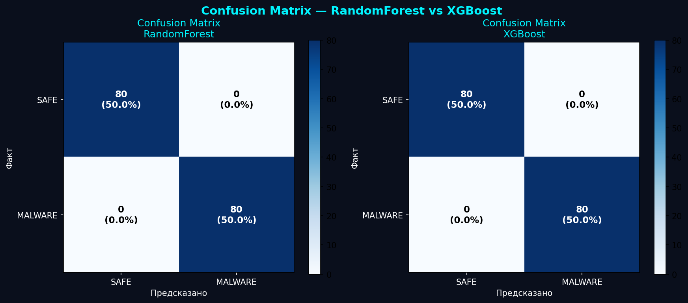
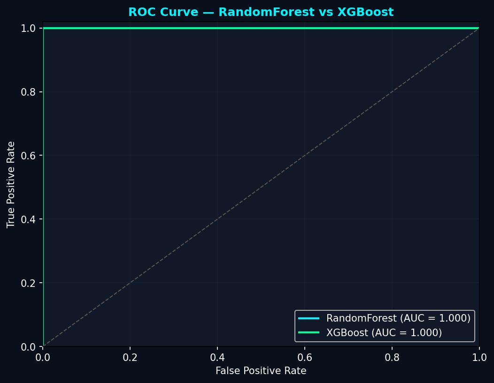
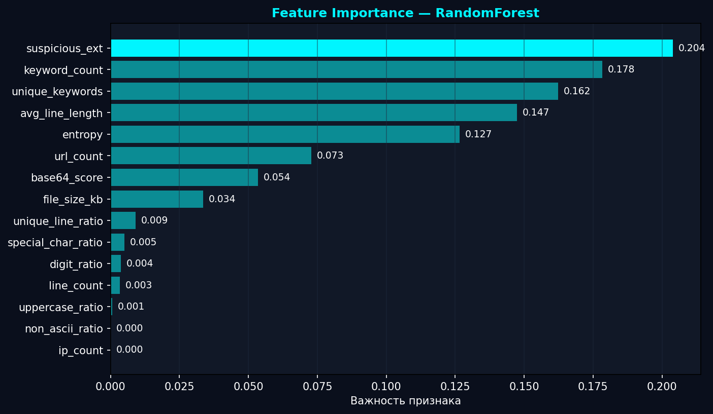
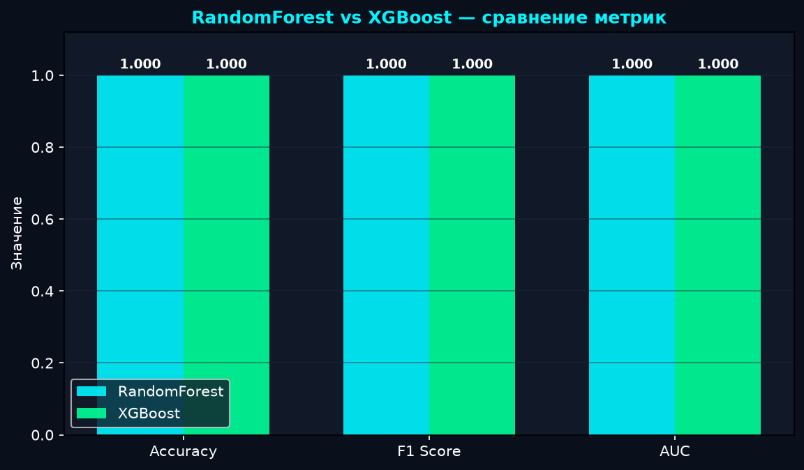

# SentinelX AI Antivirus

> Intelligent malware detection system combining heuristic analysis and machine learning


---

## Overview

SentinelX is a desktop antivirus application built from scratch in Python. It uses two independent detection methods — rule-based heuristic analysis and a trained machine learning model — to identify malicious files. Dangerous files are automatically quarantined before they can execute.

---

## Screenshots

> Dashboard — live CPU/RAM monitoring, threat counters, process list

> AI Scan — RandomForest/XGBoost verdict with confidence percentage and feature breakdown

---

## Features

| Feature | Description |
|---|---|
| **Heuristic Scanner** | Scores files by extension and suspicious keywords (powershell, wget, reg add...) |
| **Hash Checker** | SHA-256 fingerprint compared against known malware database |
| **AI Scanner** | RandomForest + XGBoost trained on 15 numeric file features |
| **Realtime Protection** | Watchdog monitors a folder and quarantines threats instantly |
| **Quarantine** | Isolates dangerous files with Restore / Delete options |
| **Activity Log** | Timestamped record of every action with search and color coding |
| **Dashboard** | Live CPU/RAM graph, threat counters, top processes |

---

## AI Module

Every file is converted into a **15-number feature vector**:

| Feature | What it measures |
|---|---|
| `entropy` | Shannon entropy — high = encrypted/packed content |
| `keyword_count` | Hits of suspicious commands (powershell, curl, reg add...) |
| `base64_score` | Presence of long base64-encoded strings (obfuscation) |
| `url_count` | Number of HTTP/HTTPS addresses found |
| `suspicious_ext` | 1 if extension is .bat / .exe / .vbs / .ps1 / .dll |
| `ip_count` | IP address patterns in content |
| `entropy` | Shannon entropy — high = encrypted/packed content |
| `keyword_count` | Hits of suspicious commands (powershell, curl, reg add...) |
| `unique_keywords` | Number of distinct suspicious commands found |
| `base64_score` | Presence of long base64-encoded strings (obfuscation indicator) |
| `url_count` | Number of HTTP/HTTPS addresses found in content |
| `ip_count` | IP address patterns (x.x.x.x) found in content |
| `suspicious_ext` | 1 if extension is .bat / .exe / .vbs / .ps1 / .dll, else 0 |
| `file_size_kb` | File size in kilobytes |
| `line_count` | Total number of lines |
| `avg_line_length` | Average characters per line |
| `uppercase_ratio` | Fraction of uppercase letters (0–1) |
| `digit_ratio` | Fraction of digit characters (0–1) |
| `special_char_ratio` | Fraction of non-alphanumeric, non-space characters |
| `non_ascii_ratio` | Fraction of bytes outside printable ASCII |
| `unique_line_ratio` | Unique lines / total lines — low value indicates packer |

Two models are trained and compared — **RandomForest** (200 trees) and **XGBoost** (200 estimators). The winner by F1 score is saved automatically.

### Results






---

## Architecture

```
SentinelX/
├── main.py                   — entry point
├── core/
│   ├── scanner.py            — file and directory scanning
│   ├── heuristic_engine.py   — keyword and extension scoring
│   ├── hash_checker.py       — SHA-256 hash verification
│   ├── quarantine.py         — isolate, restore, delete
│   ├── realtime_protection.py — watchdog-based live monitoring
│   ├── logger.py             — event logging
│   └── database.py           — SQLite threat history
├── ai/
│   ├── features.py           — 15-feature extraction
│   ├── trainer.py            — train RandomForest + XGBoost, save best
│   ├── model.py              — load model, predict single file
│   └── plots/                — confusion matrix, ROC, feature importance
└── gui/
    ├── app.py                — 7-screen PyQt6 interface
    ├── theme.py              — color tokens and stylesheets
    └── widgets.py            — reusable UI components
```

---

## Installation

```bash
git clone https://github.com/SamirAitenov/SentinelX.git
cd SentinelX
pip install -r requirements.txt
python main.py
```

### Train the AI model

```bash
python -m ai.trainer
```

Generates a synthetic dataset, trains both models, compares metrics, saves the winner to `ai/model.pkl`, and exports 4 comparison charts to `ai/plots/`.

---

## Testing

```bash
python test_all.py
```

**45 automated tests** across all modules:

- Hash Checker — SHA-256 calculation, malicious hash detection
- Heuristic Engine — correct risk level for 6 file types
- Scanner — threat detection, DB saving, quarantine
- Quarantine — move, list, restore, delete
- Logger — write, read, search, clear
- Database — save, count by risk, delete
- AI Features — all 15 features extracted correctly
- AI Model — 7 test files, 100% accuracy
- Realtime Protection — auto-detection and quarantine of new files

---

## Tech Stack

| Component | Technology |
|---|---|
| Language | Python 3.10+ |
| GUI | PyQt6 |
| Realtime monitoring | watchdog |
| Machine Learning | scikit-learn, XGBoost |
| Data processing | numpy |
| Charts | matplotlib |
| System monitoring | psutil |
| Database | SQLite |

---

## How Detection Works

```
File selected
    ↓
SHA-256 hash → compare with MALICIOUS_HASHES
    ↓
Heuristic analysis → score by extension + keywords
    ↓
If risk = HIGH → move to quarantine + save to DB + log event
    ↓
AI Scan (optional) → extract 15 features → RandomForest/XGBoost → verdict + confidence %
```

---

## Author

**Samir Aitenov** — 10th grade student, Kazakhstan

Built as a research project for academic competition and university portfolio.

---

## License

MIT License — free to use and modify with attribution.
